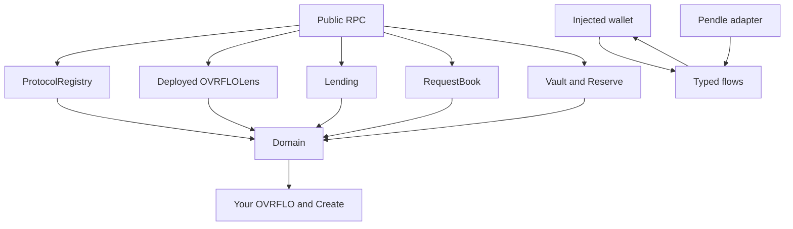

# TypeScript frontend reduction

This campaign is the **refactor half** of the 2026-09-06 reduction document. Stop at the TypeScript completion gate. Do not start Phase 15 (Rust/Leptos/Alloy). Do not implement [docs/plans/2026-09-04-001-feat-default-your-ovrflo-home-plan.md](docs/plans/2026-09-04-001-feat-default-your-ovrflo-home-plan.md). That home UI lands after this architecture is true.

Checkout HEAD is the reviewed commit `8bde4b6`. No later `src/` or `web/` commits exist on `main`.

The working tree is **not** clean. `web/` has a large uncommitted diff (Watch, Shell, BorrowFlow, Create, untracked `web/lib/demo/`). That work is the forthcoming Default home UI. Park it before ticket 01: commit it on a side branch, or start this campaign in a clean worktree at `8bde4b6`. Do not mix that UI into the reduction.

## Why this comes first

The current app still runs obsolete mechanisms that a new UI would have to inherit: a deployless stream lens, Reown/AppKit, scanner-era RPC, frontend lender-route reconstruction, a Claim All queue, and a generic `/assets` workflow. The new UI must sit on the reduced model, not on those mechanisms.

## Owner pins (this session)

- Delete `/assets` in this campaign. The new UI must not inherit the generic Assets page.
- Cancel denomination tickets 21 and 22 as `do not adopt`. Do not measure eth-compress on a stack this campaign deletes.
- Leave denomination tickets 23–25 (oxlint/oxfmt) for later. Do not block this campaign on them.

Do not edit the denomination plan file. Log those cancellations on tickets 21 and 22 when this campaign starts.

## What this campaign does not do

- Do not redesign pixels, tokens, or Default chrome.
- Do not rebuild a surviving React executor when the executor can serve as the reference (`useWriteFlow`, action graph).
- Do not keep a mechanism because tests import it or because the mechanism is reachable.
- Do not preserve 1,500 / 500 / 25 stream limits by habit. Phase 1B measurements choose the limits.

## Target architecture

Customer position authority:

- Wallet-held stream: deployed lens owner enumeration
- Borrower loan: lending borrower indexes
- Fixed Return: lending lender indexes and shares
- Waiting request: request-book borrower indexes

Borrow and post move the NFT into escrow. Those positions must not vanish because the wallet ERC-721 balance dropped.

## Campaign packaging

Follow the repo tracker in [docs/agents/issue-tracker.md](docs/agents/issue-tracker.md).

- Authoritative plan: `docs/plans/2026-09-09-001-refactor-frontend-reduction-plan.md` (copy this file after confirmation; do not edit it during implementation)
- Harness: `.scratch/frontend-reduction/spec.md`
- Tickets: `.scratch/frontend-reduction/issues/01-…`

Run an ignorance-lens sweep on that plan file before the first code ticket. Record intent before the first write. Frontend state-touching tickets also write `.scratch/decisions/YYYY-MM-DD-*.yaml`.

This campaign supersedes, for the read path and wallet stack:

- [docs/plans/2026-08-15-005-feat-stream-lens-plan.md](docs/plans/2026-08-15-005-feat-stream-lens-plan.md) (deployless lens)
- Denomination CS5 keep-deployless / `logsDivider` / viem-dlc (tickets 12–14, already in this tree)
- Denomination CS6 eth-compress (tickets 21–22)

`src/` remains the contract authority. [docs/agents/onboarding.md](docs/agents/onboarding.md) still says the request book is unbuilt. That sentence is already false (`src/OVRFLORequestBook.sol` exists). The same briefing still says the lens is deployless. That sentence is **true** at HEAD. Ticket 02 makes it false. Patch both sentences in the last docs ticket.

## Ticket sequence

One ticket per chat. Do not start a later ticket early.

### 01 — Phase 0 baseline

Record checkout SHA, toolchain, generated-artifact provenance, runtime profile, and test/deploy config.

Run typecheck, lint, unit tests, static build, and relevant E2E. Record pass, fail, and blocked separately. Missing deploy inputs are not passing evidence.

Build the production import graph (exclude tests). Run Knip or equivalent. Root `package.json` already lists `knip`; there is no config and no npm script. Ticket 01 may add a one-shot config. Do not keep Knip as a standing gate unless ticket 14 still needs it.

Classify: definitely dead, obsolete but reachable, required, test-only, uncertain.

Map each required customer behavior to entry point, on-chain authority, and an acceptance scenario. Keep the map short. It is a deletion map, not a new framework.

Known obsolete-but-reachable items at this HEAD (do not delete in ticket 01):

- Deployless lens: [web/lib/protocol/streams.ts](web/lib/protocol/streams.ts), [web/lib/generated/lens-bytecode.ts](web/lib/generated/lens-bytecode.ts), [web/lib/protocol/pin-probe.ts](web/lib/protocol/pin-probe.ts)
- Scanner RPC: [web/lib/rpc.ts](web/lib/rpc.ts) wraps every public read in `logsDivider`. `createHistoricalTransport` is unused by wagmi. `NEXT_PUBLIC_HISTORICAL_RPC_URL` is still **required in production** config and CSP.
- Reown: [web/lib/wagmi.ts](web/lib/wagmi.ts), [web/components/WalletRuntime.tsx](web/components/WalletRuntime.tsx). No first-party EIP-6963 picker.
- Claim All planner still used as a queue type host: [web/lib/claim-all.ts](web/lib/claim-all.ts) → [web/hooks/useTxQueue.ts](web/hooks/useTxQueue.ts). The CLAIM ALL button is already hidden.
- Lender-route reconstruction: [web/lib/router.ts](web/lib/router.ts) and [web/scripts/select-hydrated-route.mjs](web/scripts/select-hydrated-route.mjs). [web/lib/actions/borrow.ts](web/lib/actions/borrow.ts) still selects lender IDs. `createLiveBorrowProjectionLoader` in [web/lib/live-action-plan.ts](web/lib/live-action-plan.ts) walks `1 … min(nextPositionId-1, 500)`. Calldata already uses `previewBorrow` + `borrow(market, aprBps, amount, streamId, minAcceptable, onBehalfOf)`.
- Duplicate market discovery: [web/hooks/useAllMarkets.ts](web/hooks/useAllMarkets.ts) beside [web/lib/protocol-bootstrap.ts](web/lib/protocol-bootstrap.ts). Bootstrap has no lens and no request books. Books come from `lending.router()` plus `priorRouterAt`.
- `/assets`: [web/app/assets/page.tsx](web/app/assets/page.tsx), [web/components/assets/AssetsPage.tsx](web/components/assets/AssetsPage.tsx). New Stream from underlying still lives on `/assets`, not Create.

### 02 — Deployed OVRFLOLens (Solidity + deploy)

Replace [src/OVRFLOStreamLens.sol](src/OVRFLOStreamLens.sol) with a deployed read-only `OVRFLOLens`. The lockup is a constructor immutable with a getter. The lockup is not a per-call argument.

API:

- `streamsOfOwner(owner) → (total, StreamView[])`
- `streamsOfOwnerIn(owner, start, stop) → (total, StreamView[])`

`total` is the unfiltered ERC-721 `balanceOf`. Complete enumeration returns `(0, [])` when balance is zero. Window indices are `[start, stop)`. Reject `start >= stop` like the fork. Clamp an oversized stop. Return empty when start is at or past total.

Hydrate in the same call. Do not keep `this.hydrateOne` try/catch or per-row `ok`. Read `ownerOf(id)` and `getStream` fields. Set `isDepleted` / `wasCanceled` from the stream struct, not from `status == CANCELED`. The fork gives DEPLETED precedence, so a canceled-and-depleted stream reports DEPLETED in `status` and still has `wasCanceled == true`.

Delete `streamsByIds`. No production caller exists. Loan / request / Fixed Return details keep direct `getStream` on IDs those contracts already know.

The factory does **not** store the lens address. Do not add `setOvrfloLens`. The browser today has only `NEXT_PUBLIC_OVRFLO_FACTORY`; [tools/scripts/write-env.sh](tools/scripts/write-env.sh) emits factory, factory block/hash, schema/abi versions, and RPC. Vault, lending, reserve, stream, and request book are discovered from the factory. The lens cannot be discovered that way.

Deploy through the existing external-deploy workflow ([script/seed-local.sh](script/seed-local.sh), [script/OVRFLO.s.sol](script/OVRFLO.s.sol) comments, [tools/scripts/write-deployment-artifact.mjs](tools/scripts/write-deployment-artifact.mjs)). Add a `lens` field to the artifact. Emit `NEXT_PUBLIC_OVRFLO_LENS` from `write-env.sh`. Verify at bootstrap: expected chain, deployed code matches the artifact, `lens.lockup() == factory.ovrfloStream()`. Treat a missing or mismatched lens as protocol unavailable.

Add `OVRFLOLens` to [test/DeploySize.t.sol](test/DeploySize.t.sol). Generate ABI via [web/wagmi.config.ts](web/wagmi.config.ts) foundry plugin. Remove the creation-bytecode gate in [web/scripts/check-lens-bytecode.mjs](web/scripts/check-lens-bytecode.mjs) only after ticket 03 switches the client (or replace that script with an artifact-identity check in this ticket if the client still cannot compile without it — prefer switching in 03).

Tests: zero, one, many, transferred, canceled, depleted, canceled-and-depleted, burned (owner enum must not depend on burned IDs), owner/sender/asset, status vs flags, complete/window agreement, invalid ranges. Use the committed fork artifact. Do not change production mint permissions for a cancelable fixture. Existing [test/OVRFLOStreamLens.t.sol](test/OVRFLOStreamLens.t.sol) never covers canceled-then-depleted, so the status-derived `wasCanceled` bug is untested today. Ticket 02 must add that case. If a cancelable fixture is otherwise unreachable, label the fixture. Do not widen production mint permissions.

Read [https://ethskills.com/SKILL.md](https://ethskills.com/SKILL.md) and the Solidity discipline docs before the first Solidity write.

### 03 — Switch the client to the deployed lens

Replace deployless `eth_call` + `stateOverride` in [web/lib/protocol/streams.ts](web/lib/protocol/streams.ts) with ordinary `readContract` on `NEXT_PUBLIC_OVRFLO_LENS`. The current file also has a plain `getStream` / `ownerOf` / `withdrawableAmountOf` / `statusOf` fallback that copies the same status-derived flags. Delete that fallback when the deployed lens is the only owner-hydration path. Loan and request details may keep direct `getStream`.

Domain provenance stays: sender is a registered vault, asset is that vault’s ovrfloToken, returned owner matches the queried owner. A mismatch is an invalid/unavailable observation, not a valid position.

Keep windowed reads. Do not yet delete the rest of the deployless stack if pretest hooks still require it. Ticket 05 deletes the stack after this path is green.

### 04 — Phase 1B lens benchmark

Measure portfolios of 1, 5, 25, 100, 250, 500, 1,000, and 1,500+ streams on the intended production providers.

Record RPC latency, ABI/JSON bytes, eth_call gas, failure rate, max reliable response size, and browser decode/render cost.

Choose a complete-read policy and a window size with margin below observed failure. Keep a bounded windowed route for large accounts and resource-limit failures. Never retry a predictably oversized complete call. Never convert a contract/integrity failure into a successful empty result.

Evaluate current consumers separately: complete reader 1,500/500, wall 25, lender reconstruction 500. Those numbers are observations, not targets. Lender reconstruction dies in ticket 07, so do not size a limit for it.

### 05 — Delete the deployless frontend stack

After deployed-lens reads work:

- Delete [web/lib/generated/lens-bytecode.ts](web/lib/generated/lens-bytecode.ts)
- Delete [web/scripts/check-lens-bytecode.mjs](web/scripts/check-lens-bytecode.mjs)
- Delete [web/scripts/probe-pin-capability.mjs](web/scripts/probe-pin-capability.mjs) if no generic consumer remains
- Remove creation bytecode, `stateOverride`, deployless capability keys, per-row `ok`, and failed-row constructors from streams reads
- Remove [web/lib/protocol/pin-probe.ts](web/lib/protocol/pin-probe.ts) except any tiny snapshot helper that windowed walks still need
- Keep OVRFLO Streams artifact verification. That is not lens bytecode.

Update pretest/build hooks so they do not invoke missing files. Replace deployless tests with deployed-lens integration tests.

### 06 — Remove scanner-era RPC and viem-dlc

Audit and remove `logsDivider`, `maxBlockRange`, `PUBLIC_READ_LOG_MAX_BYTES`, historical capability checks, `createHistoricalTransport`, and browser historical-RPC handling in [web/lib/rpc.ts](web/lib/rpc.ts).

Remove `NEXT_PUBLIC_HISTORICAL_RPC_URL` from eager config, env generation, CSP ([web/scripts/build-csp.mjs](web/scripts/build-csp.mjs)), and docs when no browser consumer remains.

Preserve [web/lib/deployment.ts](web/lib/deployment.ts) `getLogs` for **build/deployment history verification**. Keep the CI ban on browser portfolio `getLogs` ([web/tests/scripts/banned-patterns.test.ts](web/tests/scripts/banned-patterns.test.ts)).

Use ordinary Viem/Wagmi HTTP/fallback transports. Keep bounded timeout/retry/concurrency only where ordinary reads need them. Distinguish execution errors from transport failures.

Remove `@morpho-org/viem-dlc` when no production import remains.

### 07 — Injected wallets; delete Claim All; delete borrow-route reconstruction

**Wallets.** Temporary path: Wagmi/Viem → injected connector → browser wallet.

Remove `@reown/appkit` and the WalletConnect/QR path from [web/lib/wagmi.ts](web/lib/wagmi.ts) and [web/components/WalletRuntime.tsx](web/components/WalletRuntime.tsx). Keep the `wallet-runtime` / E2E Turbopack seam. Support EIP-6963 plus a legacy injected fallback. Keep connect, disconnect, account, chain guard, and a small picker. Disconnect clears app connection state. Do not promise wallet permission revocation. Do not rebuild the wallet layer.

**Claim All.** Delete planner UI leftovers, feature queries, and tests. Before deleting [web/lib/claim-all.ts](web/lib/claim-all.ts), extract `QueuedTx` and **executable** `reconcileQueuedTx` into a neutral module. [web/hooks/useTxQueue.ts](web/hooks/useTxQueue.ts) and Create still call that reconciliation. Reevaluate remaining queue code after callers shrink.

**Borrow route.** Delete [web/lib/router.ts](web/lib/router.ts), [web/scripts/select-hydrated-route.mjs](web/scripts/select-hydrated-route.mjs), `createLiveBorrowProjectionLoader`, and production global lender walks. Immediate borrow is already:

`selected stream + amount + APR → previewBorrow (eth_call) → approval → exact borrow simulation → wallet → receipt → refresh`

Reuse [web/components/borrow/quote.ts](web/components/borrow/quote.ts). Display net proceeds as `actualBorrow - feeAmount`. Never send a quote transaction. Simulate the exact write after approval. Bind submission to chain, account, destination, calldata, value, and output bounds.

Keep request-book post: approve the current book, simulate `post`, then reconcile Filled vs Waiting from the receipt. Direct borrow approves lending. Post approves the book.

Fixed Return still reads **customer-owned** lender positions. That is not global borrow routing.

### 08 — Registry owner, lens-owned stream reads, snapshots

Extend [web/lib/protocol-bootstrap.ts](web/lib/protocol-bootstrap.ts) into the canonical registry. [web/hooks/useOvrflos.ts](web/hooks/useOvrflos.ts) already wraps it. Do not invent a second discovery architecture. Fold [web/hooks/useAllMarkets.ts](web/hooks/useAllMarkets.ts) duplicate discovery into that owner.

Registry facts: factory, lockup, deployed lens, vaults, underlying / ovrfloToken / reserve, approved series, current and known retired lending, current and known prior request books. Current book is `lending.router()`. Historical router records locate old positions. They do not make a retired book current. Scope identities by chain and contract.

Canonical wallet-held stream read:

`lens.streamsOfOwner(owner) → total + rows → provenance → domain rows → local filter/page`

Remove the extra `balanceOf` RPC. Where complete reads are reliable, remove ordinary-wall `useInfiniteQuery`, `wantedDepth`, `autoPages`, `AUTO_INELIGIBLE_PAGE_CAP`, page reassembly, and silent duplicate folding in [web/hooks/useStreams.ts](web/hooks/useStreams.ts) / [web/lib/stream-book.ts](web/lib/stream-book.ts). Keep only the windowed route ticket 04 justified.

A successful atomic lens call returns all requested rows or fails. Remove the partial-row model for that call. Independent portfolio sources stay independent.

Windowed owner enumeration and request-book pagination still need one snapshot: capture block number, check hash at walk boundaries, discard and restart on skew. Do not keep deployless hash-capability probes.

### 09 — Display vs write; simplify orchestration without a rebuild

Display: loading, data, error, optional stale during refresh. Confirmed empty is not a read failure. A portfolio is not complete when only some independent sources loaded.

Writes: fresh transaction-specific reads, exact simulation, current wallet identity and chain, submission, receipt / replacement, targeted refresh. Global portfolio freshness is not transaction authority.

Discard stale async results after account, chain, deployment, or input changes. Clear account data on disconnect.

Map production callers of ActionGraph, TxQueue, action-runtime, live-action-plan, and executors **before** deleting any of them. Reachability does not entitle them to survive. Canonical loop:

`next transition → fresh reads → review exact effect → simulate → wallet → confirm receipt → recompute`

Create from underlying, skip a step only on fresh evidence:

`NeedUnderlyingApproval → NeedConversion → NeedPtApproval → NeedDeposit → NeedStreamApproval → NeedBorrowOrPost → Complete or Waiting`

Preserve independent `minPtOut`, `minToUser`, and `minAcceptable`. Authenticate event origin when extracting a created stream ID. Do not guess a stream ID from wallet balance.

Fixed Return: choose a supported market/maturity, then amount and APR. Supply API is market + APR + amount. Wrap on the reserve when starting from underlying. Preserve pending/matched and unfilled-liquidity withdrawal.

Resume evidence is scoped to chain, deployment, account, intent/step, and transaction identity. Unknown receipt status is not permission to repeat a money-moving step. In TypeScript, delete unreachable transaction systems. Do not substantially rebuild a surviving React executor.

### 10 — Delete `/assets`; keep USD; dead-code sweep

Give every `/assets` capability a home, then delete the route:

- Repay shortfall → contextual Wrap on `OVRFLOReserve`
- Claimed ovrfloToken → Keep / Unwrap, subject to reserve availability
- Post-maturity ovrfloToken-to-PT → contextual vault claim (claim returns PT, not underlying)
- PT redemption → the applicable Pendle action
- New Stream from underlying → Create’s integrated Pendle conversion + deposit

Reuse conversion behavior from [web/lib/hosted-convert.ts](web/lib/hosted-convert.ts). Keep validation of hosted quote destination, recipient, assets, amount, value, and output bounds. The hosted quote is an input to validation and simulation, not authority to send arbitrary calldata. Hosted convert still disables local forks: fixture-test the validator; prove live conversion on a real fork separately.

USD: keep token amounts canonical. Keep the wstETH recipe in [web/lib/usd-recipes.ts](web/lib/usd-recipes.ts) (`stETH/USD × stEthPerToken`). Do not simplify that row to a direct USD feed. Missing, invalid, or stale quotes hide USD for that asset only. USD never enters calldata. Remove unused recipe kinds and UI toggles.

Rerun production import analysis and Knip. Delete test-only remnants. Remove `@reown/*` and `@morpho-org/viem-dlc` if ticket 06/07 left any. Update scripts, env, CSP, and docs (including onboarding lens + request-book sentences).

Expected absent: Reown/AppKit, Claim All, deployless lens bytecode and `stateOverride`, deployless probes, browser historical scanner RPC, frontend lender-route reconstruction, `/assets`.

Run typecheck, lint, tests, static build, relevant E2E, and inspect the production bundle.

## TypeScript completion gate

Required behaviors against the reduced architecture:

- Injected wallet select / connect / disconnect; account and chain protection
- Your OVRFLO: wallet-held streams, loans, Fixed Return, waiting requests, conditions, USD, details
- Create: New Stream / Self-Repaying Loan from underlying; Fixed Return with market-based term
- Existing-stream borrow: contract quote, correct approval, exact simulation, immediate borrow or fill-or-rest
- Contextual claim, repay, close, request cancel, unfilled-supply withdrawal, wrap/unwrap, maturity actions
- Reviewed effects and minimum outputs are the submitted intent; receipt then targeted refresh

Acceptance scenarios 1–8 in the source document remain binding (transfer/escrow/re-pledge, rest-then-execute, retired router, mid-flow identity change, competing fill, large portfolios, USD fail-closed, conversion/deposit/stream identity reconciliation).

Once that gate is true, **stop refactoring TypeScript**. The new UI campaign starts from this model. The Rust port waits for a later decision.

## Docs the implementer must not treat as live for this work

- [docs/agents/onboarding.md](docs/agents/onboarding.md) still says CS3 is unbuilt and the lens is deployless
- Stream-lens plan 005 chose deployless on purpose; this campaign reverses that choice
- Default home plan 2026-09-04 still names `/assets/`; this campaign deletes that route. Amend that home plan only when the UI campaign starts, not during this campaign

